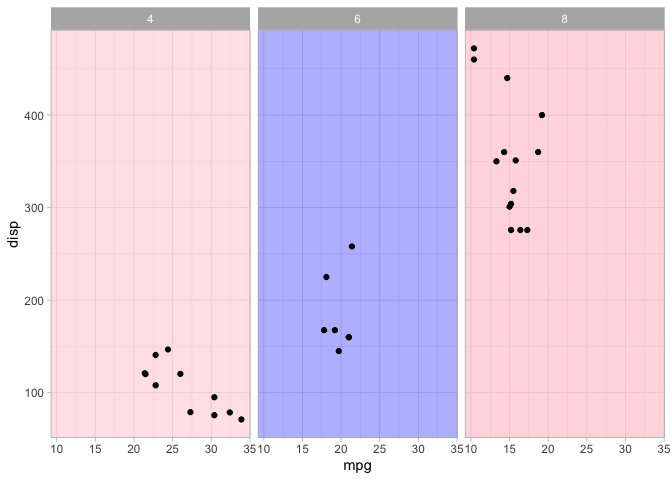

<!-- README.md is generated from README.Rmd. Please edit that file -->

# geomACA

<!-- badges: start -->
<!-- badges: end -->

`geomACA` collects some of the custom geoms I’ve created over time.
These are all somewhat janky because ggplot2 uses a very weird system,
so these are mostly for personal use.

## Installation

You can install the development version of `geomACA` from
[GitHub](https://github.com/) with:

``` r
# install.packages("devtools")
devtools::install_github("acastroaraujo/geomACA")
```

``` r
library(tidyverse)
library(geomACA)

theme_set(theme_light())
```

## Panel Backgrounds

This geom is only meant to work with facets!

``` r
ggplot(mtcars, aes(mpg, disp)) +
  ## there's a filter argument now here:
  geom_rect_bkg(aes(filter = cyl %in% c(4, 8)), fill = "pink") +
  geom_point() +
  facet_wrap(~cyl)
```


``` r

mtcars |>
  mutate(fill_lab = ifelse(cyl == 6, "blue", "pink")) |>
  ggplot(aes(mpg, disp)) +
  geom_rect_bkg(aes(fill = fill_lab), alpha = 0.05) +
  scale_fill_identity() +
  geom_point() +
  facet_wrap(~cyl)
```



## Gaussian Ellipses

[stat_ellipse](https://ggplot2.tidyverse.org/reference/stat_ellipse.html)
is pretty cool, but I wanted something more like this:

``` r
ggplot(mtcars, aes(mpg, disp)) +
  geom_point() +
  geom_mvnorm_ellipse()
```


``` r
ggplot(mtcars, aes(mpg, disp)) +
  geom_mvnorm_ellipse(aes(fill = factor(cyl)), show.legend = FALSE) +
  geom_point() 
```


